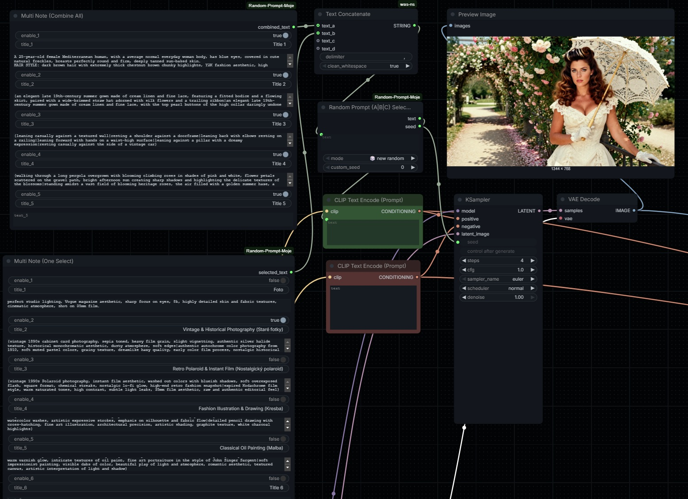
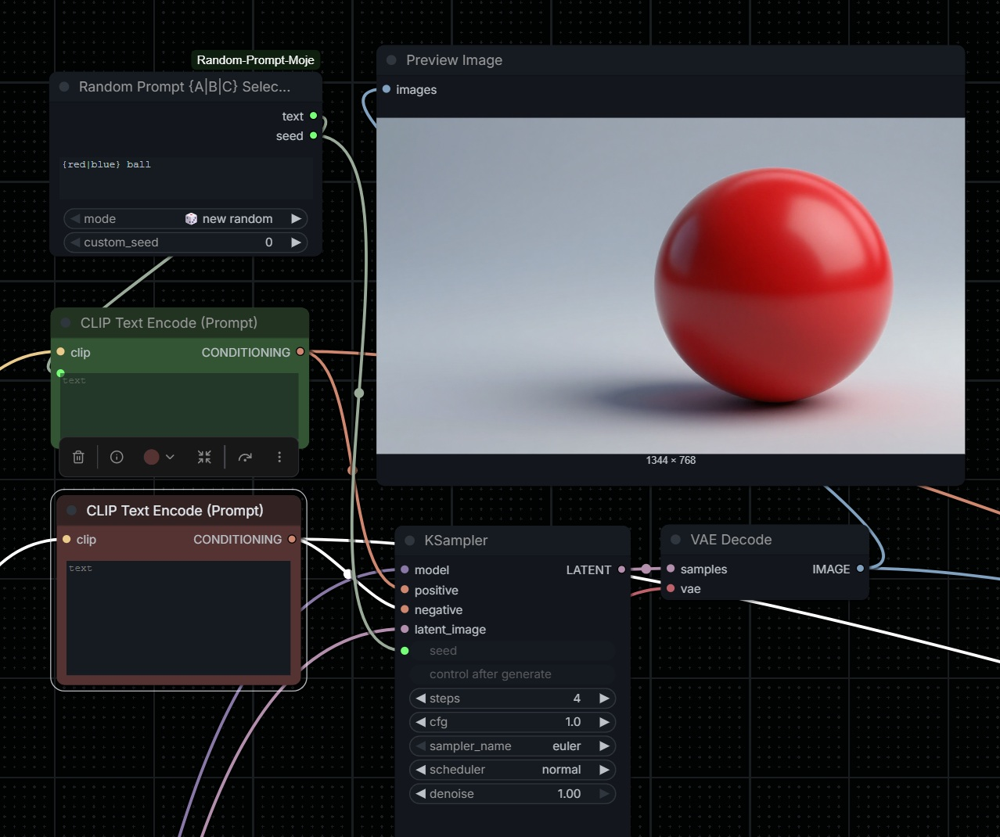
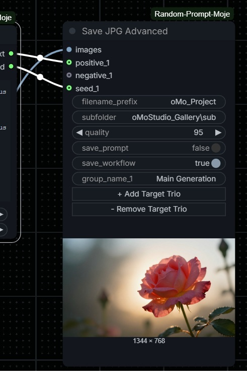

# M-Nodes for ComfyUI 🚀

A collection of utility nodes designed to streamline complex prompt engineering, dynamic note-taking, and randomized selection within ComfyUI.




## Features

### 1\. 🎲 Random Prompt {A|B|C} Selector

A powerful string manipulator that handles randomized selections.

  - **Syntax:** Use `{option A|option B|option C}` within your text.
  - **Modes:**
      - **🎲 New Random:** Generates a new seed and a new random string every execution.
      - **🔄 Fix Last Seed (Cycle):** Keeps the seed locked but cycles through all possible text combinations.
      - **✍️ Custom Seed:** Uses a manual seed to determine the selection.
      - **🛑 Fix Last Seed and Text:** Completely freezes the node (0.00s cache) to prevent any changes.

### 2\. 📝 Multi Note (Combine All)

A dynamic note-taking node that grows as you type.

  - **Dynamic UI:** Whenever you type into the last available "Content" block, a new set (Toggle, Title, Content) is automatically generated.
  - **Toggle Control:** Each note has a switch to include or exclude it from the final output.
  - **Smart Formatting:** Combines all active notes into a single string, separated by commas—perfect for building long prompts.
  - **Layout Preservation:** Remembers your custom node width even when adding new fields.

### 3\. 🔘 Multi Note (One Select)

Similar to the "Combine All" node, but functions like a **Radio Button** group.

  - **Exclusive Selection:** Enabling one note automatically disables all others in the node.
  - **Use Case:** Perfect for testing different art styles or lighting setups without deleting your previous ideas.

## 💎 Technical Highlights

  - **Persistence Pro:** Unlike many dynamic nodes, M-Nodes correctly save and restore all fields when:
      - Switching browser tabs.
      - Refreshing the page.
      - Loading a workflow from a saved PNG/JSON.
  - **Bypassing Limitations:** Uses advanced internal mapping to ensure that dynamically created fields are correctly sent to the Python backend, overcoming the standard LiteGraph limitations.
  - **Non-Intrusive:** Respects user-defined node widths during dynamic expansion.

## 📖 How to Use

### The "Master Prompt" Workflow

1.  Add a **Multi Note (Combine All)** node. Create separate blocks for `Subject`, `Pose`, `Environment`, and `Style`.
2.  Right-click the **Random Prompt Selector** and choose `Convert text to input`.
3.  Connect the `combined_text` output from the Note to the `text` input of the Selector.
4.  Use the Selector's output to feed your **CLIP Text Encode**.
5.  This setup allows you to manage massive, complex prompts in an organized way while still enjoying the power of randomized variations.

-----


### 4\. 💾 Save JPG Advanced
A bulletproof image saver that goes beyond just exporting pixels. It cleanly exports your images, readable prompt data, and complete workflows without the usual ComfyUI clutter.

Smart Image Handling: Automatically converts problematic RGBA images to RGB (with a clean white background) before saving, preventing common crashes when dealing with PNG-to-JPG conversions.

Workflow Export: Easily save your entire node graph as a .json file right next to your image.

Readable Metadata (.txt): Generates a beautifully formatted text file containing your Seeds, Positive Prompts, and Negative Prompts.

Dynamic Interface: Use the + Add Target Trio and - Remove Target Trio buttons directly on the node to create custom, labeled input slots for your prompt data.

Organized Outputs: Features a dedicated subfolder input, allowing you to easily route your generated images, text files, and JSON workflows into specific directories. This keeps your main output folder perfectly clean.

🕵️ How the "Hybrid" Metadata Saving Works (Deep Dive)
The real magic of this node lies in how it gathers data for your .txt files. It uses a hybrid "Detective" approach to ensure you get exactly the metadata you want, without duplicate clutter:

Exact Data from Wires (Manual Mode): When you use the + Add Target Trio button, you create explicit groups (e.g., "Group 2"). You can rename the group and plug in specific Positive, Negative, and Seed wires. The node prioritizes this data and writes it clearly at the top of your text file under your custom group name.

Automatic Detection (Fallback Mode): Don't want to wire everything manually? No problem. The node acts as a detective. It silently scans your entire hidden node graph (the workflow map) looking for Sampler and CLIPTextEncode nodes. It traces the wires backward to automatically extract seeds and text prompts that you didn't explicitly plug into the save node.

Smart Deduplication: The script is smart enough to compare the Auto-Detected data against your Wires. If it finds that a prompt or seed has already been saved via a manual wire, it skips it during the automatic phase. This ensures your final .txt file is clean, comprehensive, and free of annoying duplicates.

-----

5. 🔍 Show Text (Debug)
A dynamic text viewer and prompt debugger that lets you inspect exactly what is being passed down your workflow. It bridges the gap between complex upstream logic and the CLIP Text Encode, giving you total control over your final text.

Real-Time Inspection: Instantly displays the exact string generated by your previous nodes (like the Random Selector or Multi Notes), making it incredibly easy to debug long or complex prompts.

Fully Interactive Widget: The text area is completely unlocked, allowing you to click in, select all (Ctrl+A), and copy (Ctrl+C) your text at any time for manual backup or reuse.

Smart Node Auto-Resizing: Features automatic height recalculation. As your prompt changes in length, the node dynamically scales to fit the text perfectly, so you never have to scroll or resize manually.

Dual Mode Flexibility: Includes a simple mode switch (🔄 Always Update and 🔒 Lock & Edit) that lets you pivot from automated generation to manual testing in a single click.

🕵️ How the "Lock & Edit" Mode Works (Deep Dive)
To balance automation with manual control, this node utilizes a dual-state processing system. This allows you to inspect incoming variations, lock in a good result, and tweak it directly:

🔄 Always Update (Live Streaming Mode): In this mode, the node acts as a live conduit. It listens to the incoming text wire, updates the text box on your screen with the fresh prompt, and passes it along to the next node. This is the ideal setting for automated generation and exploring randomized variations.

🔒 Lock & Edit (Freeze & Tweak Mode): Once you generate a prompt variation you love, you can switch the mode to Lock & Edit. The node instantly ignores the upstream wire, freezing the text currently inside the box. You can now manually edit that text (e.g., changing a color, adding a keyword), and the node will pass your custom version downstream. Upstream randomizers won't overwrite your tweaks until you switch back to Always Update.
-----

## 🛠 Installation

1.  Open your terminal and navigate to the ComfyUI `custom_nodes` folder:
    ```bash
    cd ComfyUI/custom_nodes/
    ```
2.  Restart ComfyUI.

-----


## 📄 License

This project is licensed under the **MIT License** - see the [LICENSE](https://www.google.com/search?q=LICENSE) file for details.

## Credits

Created by **oMo.Studio** oMo.Studio@proton.me . Optimized for high-end models like **Lumina 2**, **SDXL**, and **Flux**.


